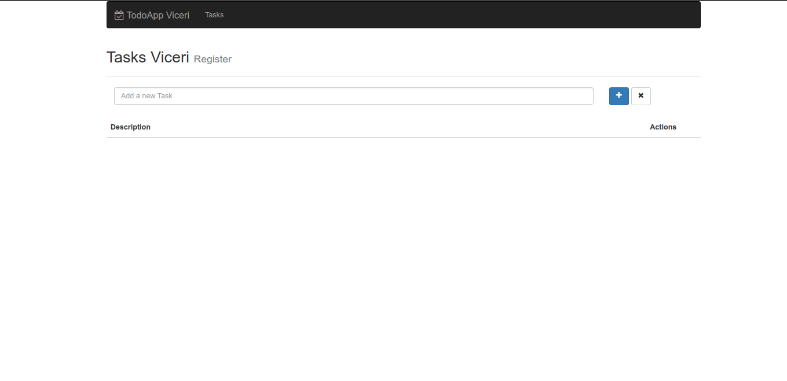

# Viceri - ReactJS - Task Manager

> *First of all - Clone the project and enter in the root directory*

```bash
    git clone git@github.com:zScrolLock/viceriTaskManager.git
    cd viceriTaskManager/
```

> or

```bash
    git clone https://github.com/zScrolLock/viceriTaskManager.git
    cd viceriTaskManager/
```

<hr>

> Download all dependencies and start project

```bash
    npm i
    npm run dev
```

> Now open the project on your browser in `localhost:8080`

<br>



*Luís Augusto - 2022*